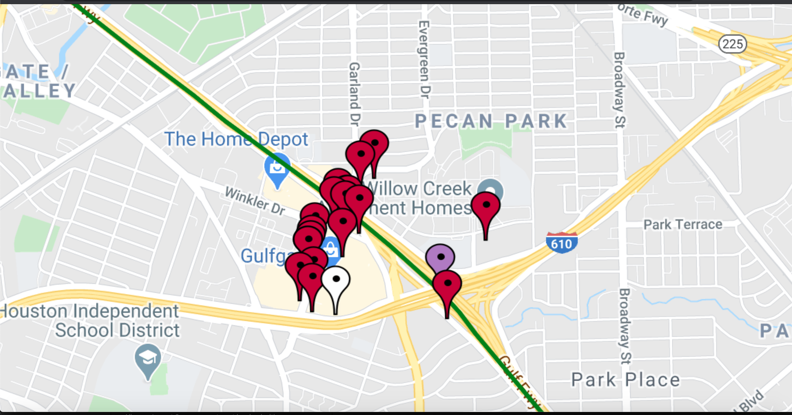
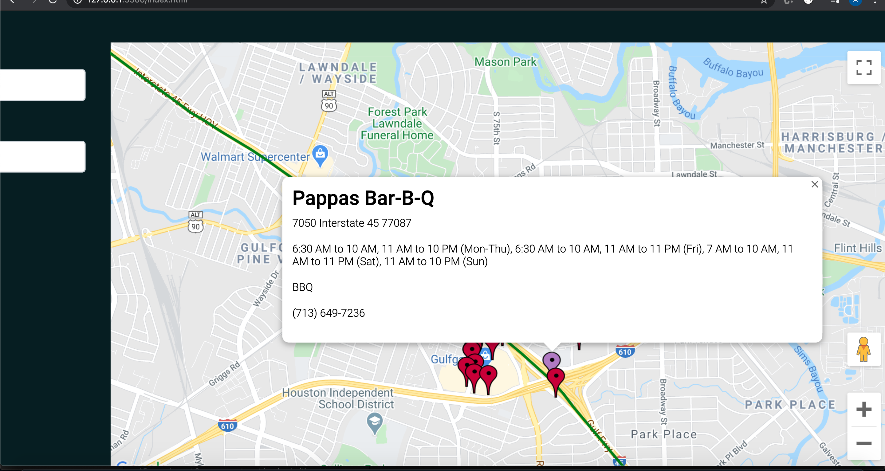

# Meet Me Halfway
## Digital Crafts group project  by John, Jesse, Daniela  and Alina
*You are welcome to check out the project here:* ADD ADDRESS! 
Our application was built using HTML, CSS, Bootstrap and JavaScript. Data is generated using GoogleMap APIs,DarkSky weather API and ZomatoAPI. Four participants collaborated using GitHub. In addition to front-end development, this project allows us to master  version control  habits and merge conflict-solving skills.
The idea of the application is to enable user to  find perfect meeting point in the middle between two addresses  distance-wise.

### Technical Requirements:
* Implement a Responsive Design that works on Chrome on OSX, iOS devices, and Android devices at 360px, 768px, and 1200+ px wide
* Access at least 2 remote APIs (data mashup!)
* Use fewer than 3 global variables (numerous constants are fine, but should be limited to primitive values like numbers and strings)
* You must host your site on AWS

### Technologies:
* HTML
* CSS
* Bootstrap
* JavaScript
* API

## How it Works:
User enters his address and friend's address and pushes "Meet Halfway!" button

The application calculates the meeting point  in the middle between to addresses and shows  it on the map  marked with lilac pin. Red pins represent restaurants and caffee close by to the meeting point.

By hovering over red pins, can see the name of the eatery. Clicking the pin shows a little pop-up window with additional information about the place.

On About Us  page  user can find information about our developer team
